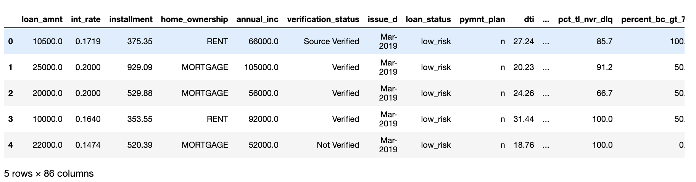
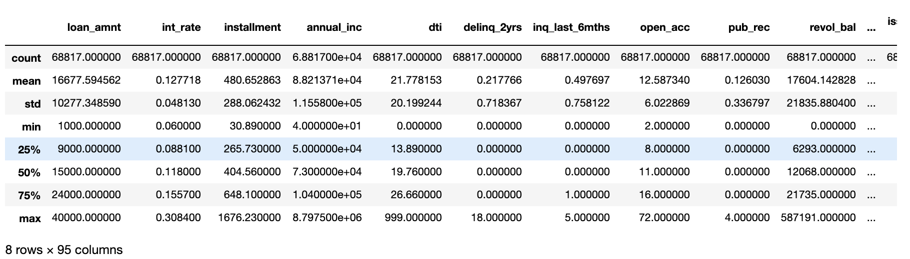
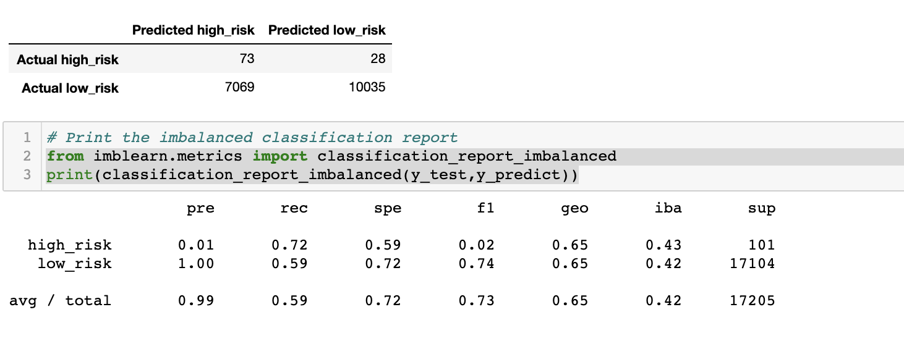
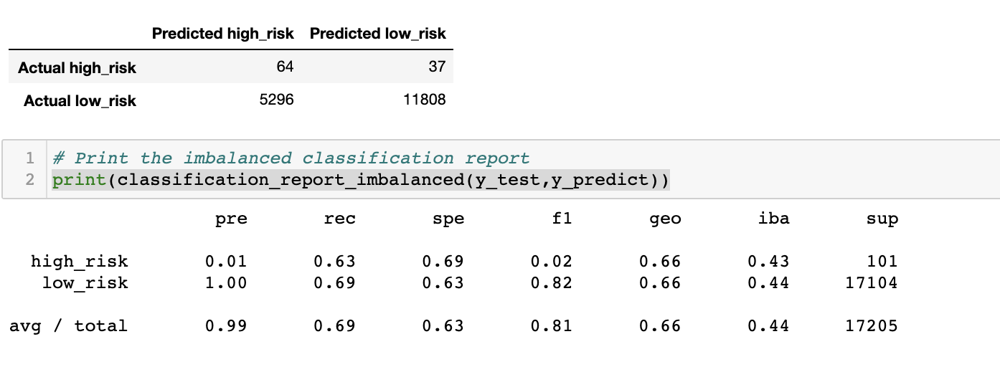
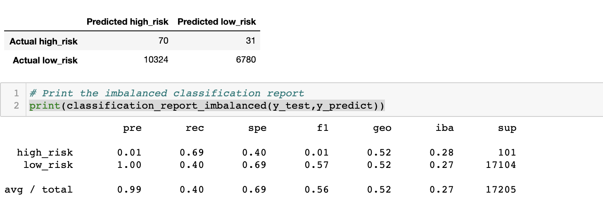
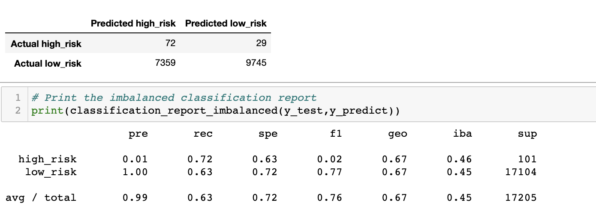
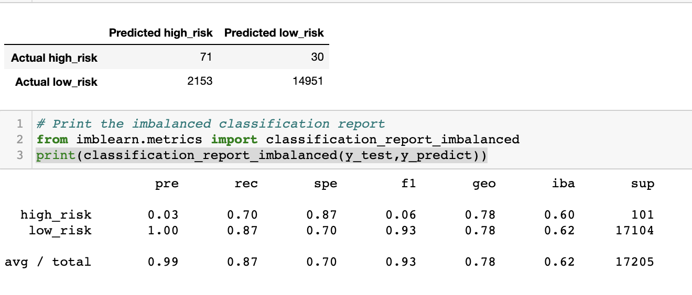
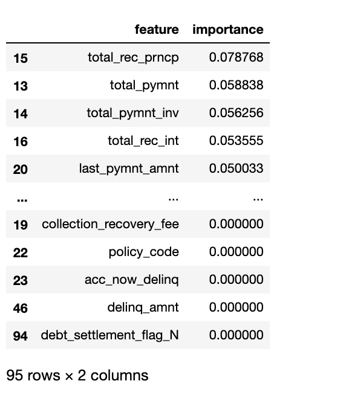
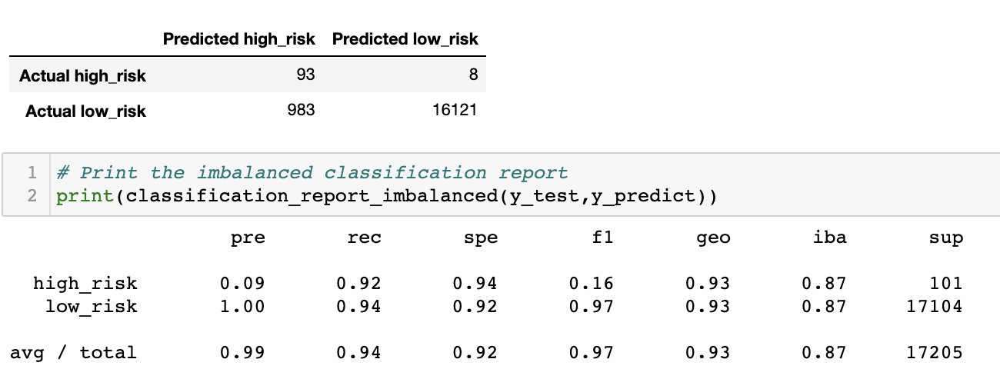

# Credit_Risk_Analysis
Machine Learning Models
## Overview
The purpose of this analysis was to create a supervised machine learning model that could accurately predict credit risk alalysis. After reading CSV file performed basic data cleaning.

### Basic Cleaned Data 

### In order to complete this task, six different methods are taken into consideration:

  - Naive Random Oversampling
  - SMOTE Oversampling
  - Cluster Centroid Undersampling
  - SMOTEENN Sampling
  - Balanced Random Forest Classifying
  - Easy Ensemble Classifying
  
Through each of these methods, I split my data using the resampled data to train and test a logistic regression model. Also, calculated balanced accuracy scores then printed confusion matrix and finally generated classification reports as my results.
### Split Data into Trainingand Testing

## Results

### Naive Random Oversampling

### SMOTE Oversampling

### Cluster Centroid Undersampling

### SMOTEENN Sampling

### Balanced Random Forest Classifying

- Also, sorted importance and features in descending order.
 

### Easy Ensemble Classifying

## Summary
This analysis is trying to find the best model that can detect if a loan is high risk or not. Becasue of that, we need to find a model that lets the least amount of high risk loans pass through undetected. That correlating statistic for this is the recall rate for high risk. Looking through the different models, the ones that scored the highest were:
  - Easy Ensemble model has the highest accuracy score (0.93) and the F-1 score for low risk (0.97) is also the highest.
    - The recommended model for credit card analysis would be the Easy Ensemble model.
  - Balanced Random Rainforest model has the second highest accuracy score at 0.79 and the F-1 low score is 0.93.
  - Naïve Random Oversampling model has an accuracy of 0.65 and a F-1 score of 0.74 for low risk.
  - SMOTE model has an accuracy score of 0.66 and the F-1 score is 0.82 for low risk.
  - UnderSampling has the lowest accuracy score at 0.54 and F-1 score of 0.70.
  - SMOTEENN model has an accuracy score of 0.64 and the F-1 score is 72 for low risk.

After factoring in these the above statistics, the model that I would recommend to use for predicting high risk loans is the Easy Ensemble Classifying model.

